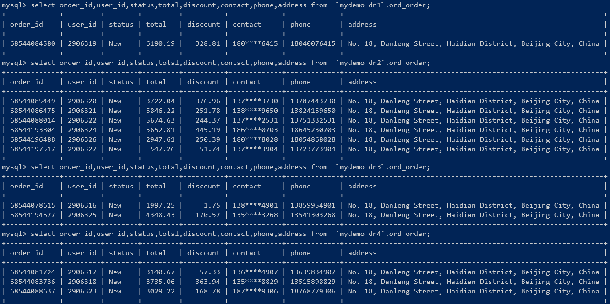
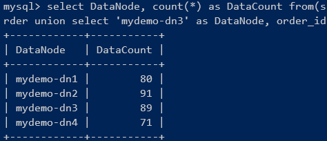
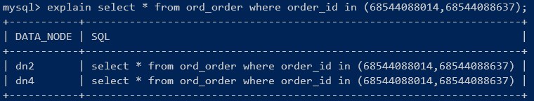

[English](README.md) | [中文](README-cn.md)

-------------------------------------------------------------------
### 演示项目架构
 <br />

本项目基础演示部分包括基于`SpringBoot`的`Dubbo`微服务和Web演示应用，另外还包含以下几个方面：

#### 1、Docker容器化
除`PinPoint`外，整个演示项目以及所有中间件都支持`Docker`容器运行，项目中包含`Dockerfile`、构建`Docker`镜像和运行`Docker`容器相关脚本。<br />
使用`Docker`容器运行演示应用，架构中用到的组件都无需部署、配置，也不需要对项目进行任何配置，使用管理脚本就可以简单快速运行整个演示应用，参考*Docker容器运行演示应用*。

#### 2、Kubernetes
- `Kubernetes`是一个优秀的自动化运维管理平台，极大简化了应用大规模部署和管理问题，结合`Service Mesh`的路由、熔断和限流，微服务架构中的非功能性需求基本都被分拆出来了，应用只需聚焦于业务逻辑。
- 不可变基础设施、基础设施即代码，基于`Docker`、`Kubernetes`、`DevOps`的云原生理念，是对运维管理的一场革命。
- 将研发团队持续集成、持续部署、持续交付能力提升一个台阶。

本项目为`Mycat` + `ZipKin`运行演示应用提供了K8s YAML配置文件，可以快速部署到`k8s`运行，参考*Kubernetes运行演示应用*。

**关于Dubbo服务在K8s中的部署** <br />
- `Dubbo`服务的注册、发现、负载均衡、故障转移都采用Dubbo自己的机制，不使用`K8s Service`。`Provider`注册时通过`Downward API`得到`POD IP`，用`POD IP`向注册中心注册，`Consumer`从注册中心拿到的`Provider`都是可以直接通讯的。
- `Dubbo`服务使用`Deployment`部署到`K8s`，无需建立`Service`，`K8s`中基于`Deployment`、`ReplicaSet`的管理功能都能运用在`Dubbo`服务上，包括手动扩缩容以及利用HPA自动扩缩容等。`POD`下线、新`POD`上线由Dubbo本身的服务注册发现机制处理。

#### 3、Service Mesh: Istio
在演示项目中尝试采用`Dubbo`服务直连方式在`Istio`中运行，没有成功。具体方案是：
- 禁用`Dubbo`注册中心，所有`Provider`不注册；
- 为`Dubbo`服务定义`K8s` `Service`，服务注册、发现由`K8s`管理；
- 为`Dubbo`服务定义`Istio` `DestinationRule`、`VirtualService`，由`Istio`对`Dubbo`的TCP流量进行管理，包括路由、负载均衡、限流、熔断等；
- `Consumer`通过`K8s`的`Service`直连`Provider`；

该方案在`Consumer`调用时出错，`Envoy`无法将调用请求路由到`Provider`。`Dubbo`支持`Istio`不太好处理，如果放弃`Dubbo`的TCP长连接，很可能丧失高性能优势，从架构选型考虑不如采用`SpringBoot`、`Spring Cloud`。

#### 4、数据库分库分表
本项目演示了使用`Mycat`和`Sharding-Proxy`进行分库分表，相关概念、部署和使用方法，参考[MyCat分库分表概览](https://github.com/liuzhibin-cn/my-demo/blob/master/docs/Sharding-Mycat-Overview-Quickstart.md)、[Sharding-Proxy分库分表概览](https://github.com/liuzhibin-cn/my-demo/blob/master/docs/Sharding-Sharding-Proxy-Overview-Quickstart.md)，以及它们与阿里云DRDS对比[DRDS产品概览](https://github.com/liuzhibin-cn/my-demo/blob/master/docs/Sharding-DRDS-Overview.md)。

`Mycat`、`Sharding-Proxy`和`DRDS`都实现了`MySQL`协议，成为独立的中间件，将分库分表、读写分离等数据存储的弹性伸缩方案与应用隔离，对应用透明，并且实现语言无关。

#### 5、分布式事务管理
`Seata`是阿里云分布式事务管理`GTS`的开源版，2019年1月开源，`1.0.0`版已经发布。相关概念、部署和使用方法参考[Seata分布式事务管理框架概览](https://github.com/liuzhibin-cn/my-demo/blob/master/docs/Seata-Distributed-Transaction-Management.md)。

`Seata`提供`AT`、`TCC`、`Saga`三种柔性事务模式，可以跨微服务和应用实现分布式事务管理，`AT`模式对应用几乎透明，使用方便，但目前还存在一些比较严重的问题：
1. 性能开销还比较高；
2. 在使用`Mycat`、`Sharding-Proxy`进行分库分表时，`Seata`会产生不少路由到全分片执行的SQL操作，详细参考[Seata分布式事务管理框架概览](https://github.com/liuzhibin-cn/my-demo/blob/master/docs/Seata-Distributed-Transaction-Management.md)文末；

#### 6、APM全链路监控
演示项目支持`PinPoint`、`SkyWalking`、`ZipKin`三种APM工具进行全链路跟踪和性能分析，相关概念、部署和使用方法，参考[PinPoint部署和使用](https://github.com/liuzhibin-cn/my-demo/blob/master/docs/APM-PinPoint.md)、[SkyWalking部署和使用](https://github.com/liuzhibin-cn/my-demo/blob/master/docs/APM-SkyWalking.md)、[ZipKin部署和使用](https://github.com/liuzhibin-cn/my-demo/blob/master/docs/APM-ZipKin.md)。三种APM工具对比：
- 使用方式：`PinPoint`和`SkyWalking`都采用`javaagent`方式，对应用代码几乎没有侵入性；ZipKin需要和应用打包到一起，并在应用中完成各种配置，属于强依赖关系；
- 链路跟踪能力：整体上看相差不大，基本都参照[Google Dapper](http://research.google.com/pubs/pub36356.html)，也都支持对大量主流框架的跟踪，细节上有些差异：
  - 对单次RPC调用分析，`ZipKin`定义的Annotations更精细，参考[ZipKin部署和使用](https://github.com/liuzhibin-cn/my-demo/blob/master/docs/APM-ZipKin.md)；
  - `PinPoint`和`SkyWalking`都提供将额外方法添加到调用链跟踪的功能，其中`PinPoint`对代码完全没有侵入性，`SkyWalking`则需要对方法添加注解；
  - `SkyWalking`支持在`Span`中添加自定义tag功能，利用该功能可以将方法参数值等额外信息记录到`Span`中，有利于问题分析；
- UI功能：`PinPoint`和`SkyWalking` UI功能比较丰富，都提供应用/服务、实例等层级的性能统计，两者各有特色；`ZipKin` UI功能最弱，只提供依赖关系、具体调用链查看分析；<br />
  额外的UI功能，可以读取APM工具的数据，自定义开发；
- 社区支持：`ZipKin`架构灵活、文档完善，社区支持度最高，`Spring Cloud`和`Service Mesh`（[istio](https://github.com/istio/)）官方提供`ZipKin`支持；`SkyWalking`是华为员工开发，已成为Apache项目；`PinPoint`为韩国公司开源；

`ZipKin`和`SkyWalking`支持`Istio`，其使用方法也与应用中直接使用有所区别。

-------------------------------------------------------------------
### 运行演示应用
#### 环境要求
- 操作系统
  - `Linux`
  - `Windows`: 必须安装一个`bash shell`，例如`git bash`；
  - `Mac`: `Mac`自带的`sed`与`GNU sed`不同，需要在`Mac`上安装`gnu-seed`: `brew install gnu-sed`
- `JDK8+`, `Apache Maven`
- 容器运行需要安装`Docker`

#### 编译打包
`./package.sh`为项目编译打包脚本，参数说明：
- 简单运行：不带任何参数执行`package.sh`，仅运行Dubbo微服务和演示应用，使用单个MySQL数据库、`Nacos`注册中心，运行4个`Dubbo`服务和1个Web应用；
- 分库分表：`-mycat`、`-sharding-proxy`二选一。
  - `-mycat`：使用`Mycat`分库分表；
  - `-sharding-proxy`：使用`Sharding-Proxy`分库分表；
- 分布式事务：
  - `-seata`：使用`Seata`分布式事务管理；
- APM全链路跟踪：`-zipkin`、`-pinpoint`、`-skywalking`三选一。
  - `-zipkin`：使用`ZipKin`进行链路跟踪、性能分析；
  - `-pinpoint`：使用`PinPoint`进行链路跟踪、性能分析；
  - `-skywalking`：使用`SkyWalking`进行链路跟踪、性能分析；

例如`./package.sh -mycat -seata -zipkin`

#### 本地运行演示应用
1. 安装MySQL，建库建表。建库脚本[docker/mysql/scripts/1-mydemo.sql](https://github.com/liuzhibin-cn/my-demo/tree/master/docker/mysql/scripts/1-mydemo.sql)，是演示分库分表用的建库脚本，简单方式运行只需要其中`mydemo-dn1`单库即可。
2. 部署`nacos`，用于`Dubbo`注册中心。参考[Nacos快速开始](https://nacos.io/zh-cn/docs/quick-start.html)即可。
3. 如果要使用到某个中间件，例如`ShardingProxy`、`PinPoint`，必须部署配置好。
4. 修改项目配置。项目配置都在[parent pom.xml](https://raw.githubusercontent.com/liuzhibin-cn/my-demo/master/pom.xml)中，包括数据库连接信息、`nacos`地址等。
5. 编译打包。参考上一节*编译打包*。
6. 按依赖关系依次启动`Dubbo`服务和Web应用:
   ```sh
   java -jar item-service\target\item-service-0.0.1-SNAPSHOT.jar
   java -jar stock-service\target\stock-service-0.0.1-SNAPSHOT.jar
   java -jar user-service\target\user-service-0.0.1-SNAPSHOT.jar
   java -jar order-service\target\order-service-0.0.1-SNAPSHOT.jar
   java -jar shop-web\target\shop-web-0.0.1-SNAPSHOT.jar
   ```

访问方式：
- `ShopWeb`：[localhost:8090/shop](http://localhost:8090/shop)
- `Nacos`：[localhost:8848/nacos](http://localhost:8848/nacos)，登录用户/密码：nacos/nacos
- `ZipKin`：[localhost:9411/zipkin](http://localhost:9411/zipkin/)
- `SkyWalking`: [localhost:8080](http://localhost:8080/)
- `Mycat`：数据端口`8066`、管理端口`9066`，都可以用`MySQL`客户端登录访问
- `ShardingProxy`：端口`localhost:3307`，可以用`MySQL`客户端登录访问

#### Docker容器运行演示应用
使用`Docker`容器运行演示项目非常简单，基础组件无需自行部署、配置，直接运行容器即可。<br />
由于`PinPoint`只能采用`HBase`存储，本项目未制作`Dockerfile`，除`PinPoint`外其它组件全部支持容器运行。
1. 基础组件构建`Docker`镜像：`docker/build-basis.sh`<br />
   相关脚本和`Dockerfile`在`docker`目录中，每个基础组件一个子目录，其中`build.sh`构建`Docker`镜像，`run.sh`启动运行Docker容器，都不需要任何参数。
2. 基础组件运行`Docker`容器：`docker/deploy-basis.sh`<br />
   最好根据需要修改`deploy-basis.sh`，仅运行本次需要用到的组件。若手工启动，注意按依赖关系依次启动：`mysql -> mycat/shardingproxy/nacos/zipkin/skywalking -> seata`。
   > 如果启用的组件比较多，例如同时启用`Mycat + Seata + SkyWalking + Nacos`，至少给`Docker`分配5G以上内存，否则内存紧张可能导致容器和应用卡死。因为不少组件内存占用比较大，例如`Seata`，JVM启动参数`-XX:MaxDirectMemorySize`小于1G时一直报OOM异常。
3. 为演示应用构建Docker镜像、运行`Docker`容器。
   1. 参考`package.sh`，编译打包；
   2. 使用`./docker/deploy-mydemo.sh`管理Docker镜像和容器，其操作对象为所有`Dubbo`服务和`shop-web`应用，参数说明：
      - `-build`：构建`Docker`镜像；
      - `-run`：运行`Docker`容器；
      - `-stop`：停止`Docker`容器；
      - `-rm`：删除`Docker`容器（需要先停止`Docker`容器）；
      - `-rmi`：删除`Docker`镜像（需要先删除`Docker`容器）；

示例：
```sh
./docker/build-basis.sh  # 为所有基础组件构建Docker镜像
./docker/deploy-basis.sh # 为所有基础组件运行Docker容器
./package.sh -mycat -seata -zipkin 		# 编译打包演示应用
./docker/deploy-mydemo.sh -build -run   # 对演示应用构建Docker镜像、运行容器
./package.sh -mycat -zipkin # 编译打包：不使用Seata
./docker/deploy-mydemo.sh -stop -rm -rmi -build -run # 重新构建Docker镜像、运行容器
```

访问入口：
- `ShopWeb`：[localhost:18090/shop](http://localhost:18090/shop)
- `Nacos`：[localhost:18848/nacos](http://localhost:18848/nacos)，登录用户/密码：nacos/nacos
- `ZipKin`：[localhost:19411/zipkin](http://localhost:19411/zipkin/)
- `SkyWalking`: [localhost:18080](http://localhost:18080/)
- `Mycat`：数据端口`18066`、管理端口`19066`，都可以用`MySQL`客户端登录访问
- `ShardingProxy`：端口`localhost:13307`，可以用`MySQL`客户端登录访问
- `MySQL`：`13306`，可以用`MySQL`客户端登录访问

`Docker`容器：<br />


容器资源使用情况：<br />


#### Kubernetes运行演示应用
1. 部署和启动`Kubernetes`环境。国内环境在`Docker Desktop for Windows/Mac`中启用`Kubernetes`，参考[AliyunContainerService/k8s-for-docker-desktop](https://github.com/AliyunContainerService/k8s-for-docker-desktop)。
2. 参考*Docker容器运行*，为基础组件`MySQL`、`Nacos`、`Mycat`、`ZipKin`构建`Docker`镜像。
   无需为演示应用构建`Docker`镜像，在下面脚本中会自动重新打包应用，构建`Docker`镜像。
3. 执行`./k8s/deploy-k8s.sh`在`K8s`中部署演示应用。<br />
   如果部署过程有错误，执行`./k8s/undeploy-k8s.sh`可以将`k8s`中已经部署好的部分全部删除。

访问入口：
- `ShopWeb`：[localhost:30090/shop](http://localhost:30090/shop)
- `Nacos`：[localhost:30048/nacos](http://localhost:30048/nacos)，登录用户/密码：nacos/nacos
- `ZipKin`：[localhost:30041/zipkin](http://localhost:30041/zipkin/)
- `Mycat`：数据端口`30066`、管理端口`30067`，都可以用MySQL客户端登录访问
- `MySQL`：`30006`，可以用MySQL客户端登录访问

备注说明：
1. 简单起见，本演示项目采用`NodePort`方式向`K8s`集群外部暴露端口，方便`Docker Desktop`单机模式本地访问，可自行尝试`Ingress`等其它`K8s`方案。
2. 基础组件多为有状态服务，不支持扩缩容（会数据不一致、错误等），另外未采用`PV`、`PVC`等，`POD`重启所有数据都会丢失。
3. 所有`Dubbo`服务支持`K8s`扩缩容（`user-service`默认部署了2个`POD`），可以尝试`K8s`管理（在`Docker Desktop`中`shop-web`不支持扩容，因为使用了`NodePort`）：
   ```sh
   # 将user-service扩容到3个POD
   kubectl scale --replicas=3 -f deployment/svc-user-deployment.yaml
   # 扩容后可以开启3个窗口，监控user-service POD日志，查看负载均衡分配情况
   # 1. 找出user-service的POD
   kubectl get pods | grep svc-user
   # 2. 监控每个POD中的容器日志（根据上面语句结果更换容器名称）
   kubectl logs svc-user-68ff844499-9zqf8 -c svc-user -f
   kubectl logs svc-user-68ff844499-dgsnx -c svc-user -f
   ...
   ```


-------------------------------------------------------------------
### 运行效果
`shop-web`日志输出：<br />


`order-service`日志输出，打印了Seata分布式事务日志：<br />


使用数据库水平拆分后的数据分布情况:<br />
<br />


`Mycat`的执行计划:<br />


`ZipKin`：<br />


`PinPoint`：<br />

