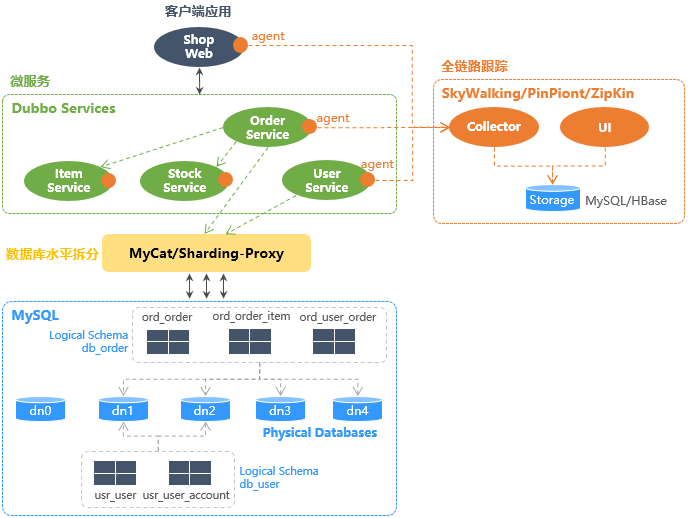
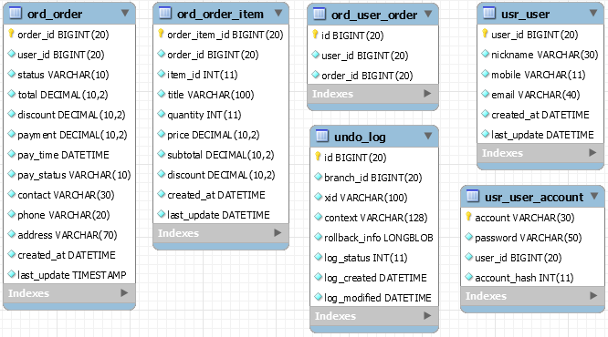
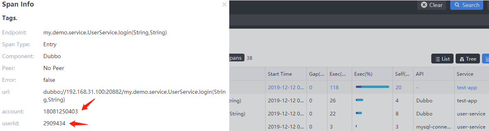
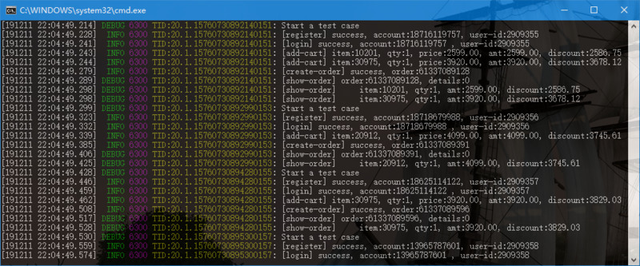

-------------------------------------------------------------------
#### 演示应用说明
 <br />
`ItemService`、`StockService`没有建表，应用中生成mock数据。

##### 表结构
 <br />

- `user`: 会员表 <br />
  _分片字段_：`user_id` <br />
  _分片规则_：`(user_id % 32) => { 0-15: dn1, 16-31: dn2 }` <br />
  _数据节点_：`dn1`, `dn2`
- `user_account`: 会员登录账号表（支持一个会员建立多个登录账号，例如手机、邮箱） <br />
  会员注册时先插入登录账号记录，利用Mycat全局序列生成`user_id`，然后再插入会员记录到`user`表；登录时使用`account` + `account_hash`查找登录账号，进行登录校验并得到`user_id`，用于从`user`读取会员数据。<br />
  _分片字段_：`account_hash`，`account.hashCode()`的绝对值<br />
  _分片规则_：`(account_hash % 2) => { 0: dn1, 1: dn2 }`<br />
  _数据节点_：`dn1`, `dn2` 
- `order_header`, `order_detail`: 订单主表、明细表，`order_detail`以父子关系表进行分片（Mycat ER分片）。`order_id`创建订单时由订单服务在应用代码中生成，`detail_id`使用Mycat全局序列生成；<br />
  _分片字段_：`order_id`<br />
  _分片规则_：`(order_id % 32) => { 0-7: dn1, 8-15: dn2, 16-23: dn3, 24-31: dn4 }`<br />
  _数据节点_：`dn1`, `dn2`, `dn3`, `dn4`
- `user_order`: `user_id`与`order_id`的自建索引表，用于查询会员订单列表。创建订单时插入索引记录，查会员订单时先从`user_order`查订单ID列表，然后再从`order_header`查订单数据；<br />
  _分片字段_：`user_id` <br />
  _分片规则_：`(user_id % 32) => { 0-15: dn1, 16-31: dn2 }` <br />
  _数据节点_：`dn1`, `dn2`

##### 运行演示项目
1. JDK8+，配置、部署Redis、MySQL、Mycat、SkyWalking；
2. MySQL建表，参考[sql-schema.sql](docs/sql-schema.sql)；
3. 运行演示项目：
   1. 先本地编译安装`service-client`：`mvn install`；
   2. 依次启动`item-service`、`stock-service`、`user-service`、`order-service`，最后启动`test-app`执行演示用例；

运行SpringBoot项目方法：
```sh
# 1. 直接用maven运行
mvn spring-boot:run
# 2. 打包运行
mvn clean package spring-boot:repackage
java -jar xxx-service-0.0.1-SNAPSHOT.jar.jar
```

-------------------------------------------------------------------
#### Mycat水平拆分
[Mycat](http://www.mycat.io/)版本[1.6.7.3](http://dl.mycat.io/1.6.7.3/)，Mycat配置文件参考[docs/mycat-conf](https://github.com/liuzhibin-cn/my-demo/tree/master/docs/mycat-conf)。

##### Mycat配置
使用了Mycat全局序列，数据库方式，SQL脚本参考[sql-schema.sql](docs/sql-schema.sql)。

- [server.xml](docs/mycat-conf/server.xml)：配置服务器参数，配置逻辑用户名密码：
  ```xml
  <user name="mydemo" defaultAccount="true">
    <property name="password">mydemo</property>
    <property name="schemas">my-demo</property>
  </user>
  ```
- [schema.xml](docs/mycat-conf/schema.xml)：配置dataHost、dataNode、逻辑schema：
  ```xml
  <mycat:schema xmlns:mycat="http://io.mycat/">
	  <schema name="my-demo" checkSQLschema="false" sqlMaxLimit="100">
		<table name="order_header" primaryKey="order_id" dataNode="dn$1-4" rule="order-rule">
			<childTable name="order_detail" primaryKey="detail_id" joinKey="order_id" parentKey="order_id" />
		</table>
		<table name="user" primaryKey="user_id" dataNode="dn1, dn2" rule="user-rule" />
		<table name="user_account" primaryKey="account" dataNode="dn1, dn2" rule="user-account-rule" />
		<table name="user_order" dataNode="dn1, dn2" rule="user-rule" />
	  </schema>
	  <dataNode name="dn0" dataHost="db1" database="mydemo-dn0" />
	  <dataNode name="dn1" dataHost="db1" database="mydemo-dn1" />
	  <dataNode name="dn2" dataHost="db1" database="mydemo-dn2" />
	  <dataNode name="dn3" dataHost="db2" database="mydemo-dn3" />
	  <dataNode name="dn4" dataHost="db2" database="mydemo-dn4" />
	  <dataHost name="db1" maxCon="5" minCon="5" balance="0" writeType="0" dbType="mysql" dbDriver="native">
		<heartbeat>select user()</heartbeat>
		<writeHost host="localhost" url="localhost:3306" user="root" password="1234" />
	  </dataHost>
	  <dataHost name="db2" maxCon="5" minCon="5" balance="0" writeType="0" dbType="mysql" dbDriver="native">
        <heartbeat>select user()</heartbeat>
        <writeHost host="127.0.0.1" url="127.0.0.1:3306" user="root" password="1234" />
	  </dataHost>
  </mycat:schema>
  ```
- [rule.xml](docs/mycat-conf/rule.xml)：配置分片规则：
  ```xml
  <mycat:rule xmlns:mycat="http://io.mycat/">
	  <tableRule name="order-rule">
		<rule>
			<columns>order_id</columns>
			<algorithm>order-func</algorithm>
		</rule>
	  </tableRule>
	  <tableRule name="user-account-rule">
		<rule>
			<columns>account_hash</columns>
			<algorithm>user-account-func</algorithm>
		</rule>
	  </tableRule>
	  <function name="order-func" class="io.mycat.route.function.PartitionByPattern">
		<property name="patternValue">32</property> <!-- 对32求模 -->
		<!-- 求模结果按照文件配置的规则映射到分片 -->
		<property name="mapFile">order-partition.txt</property> 
	  </function>
	  <function name="user-account-func" class="io.mycat.route.function.PartitionByMod">
		<property name="count">2</property> <!-- 数据分为2片 -->
	  </function>
  </mycat:rule>
  ```
- [order-partition.txt](docs/mycat-conf/order-partition.txt)，配置分片映射关系：
  ```
  0-7=0
  8-15=1
  16-23=2
  24-31=3
  ```
- [sequence_db_conf.properties](docs/mycat-conf/sequence_db_conf.properties)，配置Mycat全局序列位于哪个dataNode：
  ```
  GLOBAL=dn0
  ORDERDETAIL=dn0
  USER=dn0
  ```

##### Windows环境
Windows环境下载[Mycat-server-1.6.7.3-release-20190927161129-win.tar.gz](http://dl.mycat.io/1.6.7.3/20190927161129/Mycat-server-1.6.7.3-release-20190927161129-win.tar.gz)

有2种运行方式：
- 通过`bin\startup_nowrap.bat`在命令行直接运行。
  > 注意：需要在命令行进入`bin`目录后再执行`startup_nowrap.bat`命令，否则会将命令行所处当前目录作为Mycat主目录，导致无法找到`lib`等目录，`classpath`无法加载jar文件。
- 通过`bin\mycat.bat install`注册为Windows服务（以管理员身份运行），开机自动启动。
  > 注意：
  > 1. 需要修改`conf\wrapper.conf`文件，将`wrapper.java.command=java`改为全路径，例如`wrapper.java.command=E:\dev-tools\java\bin\java`，否则服务启动时报无法找到`java`命令，启动失败；
  > 2. 在`conf\wrapper.conf`中配置Mycat JVM启动参数；

##### Mac/Linux环境
```sh
bin/mycat start      # 启动
bin/mycat stop       # 停止
bin/mycat console    # 前台运行
bin/mycat status     # 查看启动状态
```

##### Mycat管理
Mycat启动之后，`8066`为数据端口，`9066`为管理端口，支持Mycat管理命令。连接Mycat使用`server.xml`文件中定义的用户名和密码。
> Mac环境连接Mycat必须指定TCP协议，否则会直接连接mysql的3306端口而不是Mycat，没有任何错误信息：
> ```sh
> mysql -h localhost -P 8066 -uroot -p --protocol=TCP
> mysql -h localhost -P 9066 -uroot -p --protocol=TCP
> ```

管理端口登录，通过`show @@help;`查看Mycat提供的管理命令，例如`show @@datasource;`：
```
+----------+-----------+-------+-----------+------+------+--------+------+------+---------+-----------+------------+
| DATANODE | NAME      | TYPE  | HOST      | PORT | W/R  | ACTIVE | IDLE | SIZE | EXECUTE | READ_LOAD | WRITE_LOAD |
+----------+-----------+-------+-----------+------+------+--------+------+------+---------+-----------+------------+
| dn1      | localhost | mysql | localhost | 3306 | W    |      0 |    5 |    5 |     623 |         0 |          0 |
| dn0      | localhost | mysql | localhost | 3306 | W    |      0 |    5 |    5 |     623 |         0 |          0 |
| dn3      | 127.0.0.1 | mysql | 127.0.0.1 | 3306 | W    |      0 |    5 |    5 |     623 |         0 |          0 |
| dn2      | localhost | mysql | localhost | 3306 | W    |      0 |    5 |    5 |     623 |         0 |          0 |
| dn4      | 127.0.0.1 | mysql | 127.0.0.1 | 3306 | W    |      0 |    5 |    5 |     623 |         0 |          0 |
+----------+-----------+-------+-----------+------+------+--------+------+------+---------+-----------+------------+
```

##### Tips
- Mycat的全局序列不太方便的地方：插入数据后未找到有效获取本次生成的sequence值的方法；
- Mycat 2.0在开发中，参考[Mycat2](https://github.com/MyCATApache/Mycat2) <br />
  从新特性来看，结果集缓存、自动集群管理、支持负载均衡等主要特性没有必要由Mycat管理，使用第三方即可。
- 简单性能对比测试 <br />
  Mac book pro，单机测试，50并发线程，对相同的业务逻辑功能（使用手机号+密码注册会员）进行测试，TPS指被测试业务逻辑的每秒执行次数（包含`select from user_account` + `insert into user` + `insert into user_account`）：
  - Mycat + MyBatis，分片: TPS在2200上下波动；
  - MyBatis，不分片: TPS在2600上下波动；
  - 纯JDBC，不分片: TPS在3400上下波动；<br />
  单机测试，Mycat server的CPU占用对测试结果有一定影响。<br />
  从结果看中间加一层mycat后性能有一定下降，但幅度不大，不及MyBatis与原生JDBC之间的差异。
- 分片方案：算法选择充分考虑扩容时简化数据迁移、避免高并发插入时的热点、避免XA事物；

-------------------------------------------------------------------
#### SkyWalking全链路跟踪
[Apache SkyWalking](http://skywalking.apache.org/)版本[6.5.0](http://archive.apache.org/dist/skywalking/)

##### 部署
Windows环境单机部署，演示环境存储到MySQL，生产环境存储采用ElasticSearch：
1. 下载[SkyWalking 6.5.0 Windows包](http://archive.apache.org/dist/skywalking/6.5.0/apache-skywalking-apm-6.5.0.zip)，解压；
2. 下载[MySQL Connector/J](https://dev.mysql.com/downloads/connector/j/)放入`oap-libs`，本文使用`8.0.18`版本；
3. 配置：
   1. `config/application.yml`：Backend启动时检查并自动创建MySQL表，无需手工创建；
      - `storage`注释掉`h2`改用`mysql`，设置JDBC连接、用户密码，添加`dataSource.useSSL: false`；
	  - `receiver-trace`、`service-mesh`下面的`bufferPath`指定一个绝对路径，使用默认配置时Mac和Windows环境都发现实际路径有点乱（Mac下两个路径都在skywalking父目录，Windows下一个在父目录一个在skywalking目录）；
   2. `webapp/webapp.yml`：Web UI配置，全部采用默认值；
4. 启动：`oapService.bat`启动Backend，`webappService.bat`启动Web UI，`startup.bat`启动所有；
   > SkyWalking使用`start`批处理命令新开cmd窗口启动Backend和Web UI，使用cmd的默认代码页（Win10下为936），导致Console异常和日志信息的中文显示为乱码，本文通过注册表修改cmd默认代码页，可能需要重启才能生效，临时解决办法修改`oapService.bat`：
   > ```
   > @REM start "%OAP_PROCESS_TITLE%" %_EXECJAVA% "%OAP_OPTS%" -cp "%CLASSPATH%" org.apache.skywalking.oap.server.starter.OAPServerStartUp
   > %_EXECJAVA% "%OAP_OPTS%" -cp "%CLASSPATH%" org.apache.skywalking.oap.server.starter.OAPServerStartUp
   > ```

> Mac环境下载[apache-skywalking-apm-6.5.0.tar.gz](http://archive.apache.org/dist/skywalking/6.5.0/apache-skywalking-apm-6.5.0.tar.gz)即可，部署上没有其它特别之处。

##### 使用Agent
配置`agent\config\agent.config`：
```
agent.service_name=${SW_AGENT_NAME:unknown}
collector.backend_service=${SW_AGENT_COLLECTOR_BACKEND_SERVICES:192.168.31.108:11800}
# 其它保留默认配置
```

启动应用时通过`-javaagent`指定SkyWalking代理，`-Dskywalking.agent.service_name`指定应用名称：
```sh
java -javaagent:F:\workspace\skywalking\agent\skywalking-agent.jar -Dskywalking.agent.service_name=item-service -jar item-service\target\item-service-0.0.1-SNAPSHOT.jar
java -javaagent:F:\workspace\skywalking\agent\skywalking-agent.jar -Dskywalking.agent.service_name=stock-service -jar stock-service\target\stock-service-0.0.1-SNAPSHOT.jar
java -javaagent:F:\workspace\skywalking\agent\skywalking-agent.jar -Dskywalking.agent.service_name=user-service -jar user-service\target\user-service-0.0.1-SNAPSHOT.jar
java -javaagent:F:\workspace\skywalking\agent\skywalking-agent.jar -Dskywalking.agent.service_name=order-service -jar order-service\target\order-service-0.0.1-SNAPSHOT.jar
java -javaagent:F:\workspace\skywalking\agent\skywalking-agent.jar -Dskywalking.agent.service_name=test-app -jar test-app\target\test-app-0.0.1-SNAPSHOT.jar
```

##### 链路跟踪添加属性
SkyWalking链路跟踪只记录方法全限定名，不记录参数值，可通过代码添加：<br />


pom添加依赖项：
```xml
<dependency>
    <groupId>org.apache.skywalking</groupId>
    <artifactId>apm-toolkit-trace</artifactId>
    <version>6.5.0</version>
</dependency>
```

代码中在当前span上添加tag，链路跟踪中即可看到tag名称和值：
```java
ActiveSpan.tag("itemId", String.valueOf(itemId));
```

如果当前方法没有被SkyWalking跟踪，需要在方法上添加`@Trace`注解。

> 1. 通过AOP实现跟踪，因此静态方法添加`@Trace`无效，只能用于实例方法；
> 2. 默认跟踪Dubbo服务方法，无需额外添加`@Trace`注解，参考[Supported middleware, framework and library](https://github.com/apache/skywalking/blob/master/docs/en/setup/service-agent/java-agent/Supported-list.md)；

MySQL记录SQL语句参数，在`agent\config\agent.config`文件中将`plugin.mysql.trace_sql_parameters`设为true。

##### 在日志中输出全局`trace-id`
  <br />
未被跟踪的方法`trace-id`输出`TID:N/A`

pom添加依赖项：
```xml
<dependency>
    <groupId>org.apache.skywalking</groupId>
    <artifactId>apm-toolkit-logback-1.x</artifactId>
    <version>6.5.0</version>
</dependency>
```

logback日志layout使用`org.apache.skywalking.apm.toolkit.log.logback.v1.x.TraceIdPatternLogbackLayout`，通过`%TID`输出`trace-id`：
```xml
<appender name="APP" class="ch.qos.logback.core.ConsoleAppender">
    <encoder class="ch.qos.logback.core.encoder.LayoutWrappingEncoder">
        <charset>UTF-8</charset>
        <layout class="org.apache.skywalking.apm.toolkit.log.logback.v1.x.TraceIdPatternLogbackLayout">
            <pattern>${CONSOLE_LOG_PATTERN:-%clr([%d{${LOG_DATEFORMAT_PATTERN:-yyMMdd HH:mm:ss.SSS}}]){faint} %clr(${LOG_LEVEL_PATTERN:-%5p}) %clr(${PID:- }){magenta} %clr(%tid){yellow}%clr(:){faint} %m%n${LOG_EXCEPTION_CONVERSION_WORD:-%wEx}}</pattern>
        </layout>
    </encoder>
</appender>
```

-------------------------------------------------------------------
#### Dubbo基础用法
使用[apache/dubbo-spring-boot-project](https://github.com/apache/dubbo-spring-boot-project)与SpringBoot集成，注册中心使用Redis。

1. `pom.xml`添加依赖项：
   ```xml
   <dependency>
        <groupId>org.apache.dubbo</groupId>
        <artifactId>dubbo-spring-boot-starter</artifactId>
        <version>2.7.4.1</version>
   </dependency>
   <dependency>
     <groupId>org.apache.dubbo</groupId>
     <artifactId>dubbo</artifactId>
     <version>2.7.4.1</version>
   </dependency>
   <dependency> <!-- dubbo: serialization -->
     <groupId>de.ruedigermoeller</groupId>
     <artifactId>fst</artifactId>
     <version>2.57</version>
   </dependency>
   <dependency> <!-- dubbo: use redis registry, dubbo uses jedis client -->
       <groupId>redis.clients</groupId>
       <artifactId>jedis</artifactId>
   </dependency>
   ```
2. 在`application.yml`中配置protocol、registry等：
   ```yaml
   dubbo:
       application:
           id: srv-item
           name: srv-item
           qosEnable: false
        protocol:
            id: dubbo
            name: dubbo
            port: 20880
            threads: 3
            iothreads: 1
            server: netty
            client: netty
            status: server
            serialization: fst
            queues: 0
            keepAlive: true
        registry: 
            id: redis
            address: redis://127.0.0.1:6379
   ```
   最新配置项参考[ApplicationConfig](https://github.com/apache/dubbo/blob/master/dubbo-common/src/main/java/org/apache/dubbo/config/ApplicationConfig.java)、[ProtocolConfig](https://github.com/apache/dubbo/blob/master/dubbo-common/src/main/java/org/apache/dubbo/config/ProtocolConfig.java)、[RegistryConfig](https://github.com/apache/dubbo/blob/master/dubbo-common/src/main/java/org/apache/dubbo/config/RegistryConfig.java)、[MonitorConfig](https://github.com/apache/dubbo/blob/master/dubbo-common/src/main/java/org/apache/dubbo/config/MonitorConfig.java)、[ServiceConfig](https://github.com/apache/dubbo/blob/master/dubbo-config/dubbo-config-api/src/main/java/org/apache/dubbo/config/ServiceConfig.java)、[ReferenceConfig](https://github.com/apache/dubbo/blob/master/dubbo-config/dubbo-config-api/src/main/java/org/apache/dubbo/config/ReferenceConfig.java)
3. SpringBoot启动类上指定Dubbo组件扫描范围：
   ```java
   @Configuration
   @EnableAutoConfiguration
   @ComponentScan(basePackages={"my.demo.service.item"})
   @DubboComponentScan(basePackages = { "my.demo.service.item" })
   public class Application {
	   public static void main(String[] args) {
		   new SpringApplicationBuilder(Application.class)
			   .web(WebApplicationType.NONE).run(args);
	   }
   }
   ```
4. 暴露Dubbo服务的类上使用`@Service`注解（不再需要Spring的`@Component`），引用Dubbo服务使用`@Reference`（不再需要Spring的`@Autowired`）；
