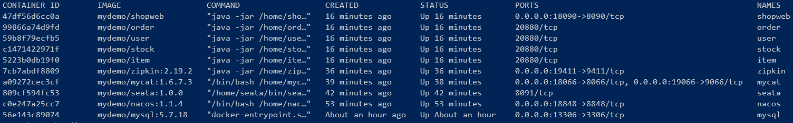
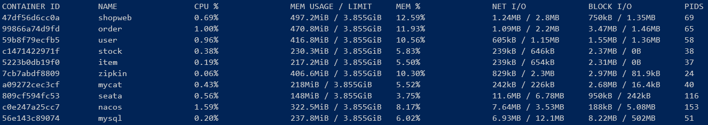
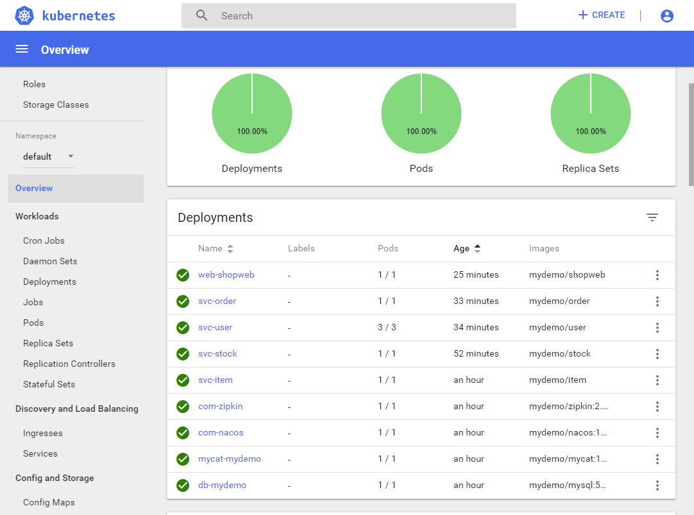
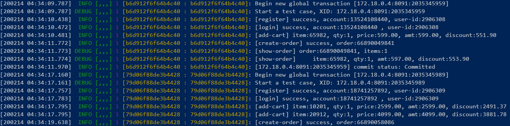
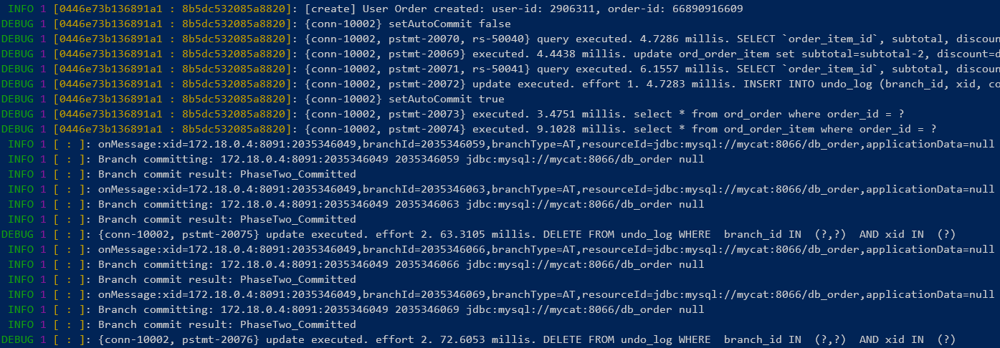

[English](README.md) | [中文](README-cn.md)

A simple demo application for building scalable applications using Microservices, Database Sharding Proxies, Flexible Transactions, APM tools, and deploying to Docker and Kubernetes.

-------------------------------------------------------------------
### Demo Application Architecture


- [Dubbo](http://dubbo.apache.org/en-us/): A high-performance, java based open source RPC framework. <br />
  `Dubbo` employs a client based, decentralized load balance mechanism. Consumers fetch providers from registry servers to client at startup, create long living TCP connections and comunicate directly to providers, with variant configurable load balance and fail over algorithms. Availability of providers is detected by heartbeat, and new provider registration events are notified by registry servers to all consumers. <br />
  `Dubbo` provides better performance than `Spring Cloud`, it can be deployed and scaled in Kubernetes, using its own service discovery, load balance and fail over mechanisms, but it's difficult to integrate with `Istio`.
- [Nacos](https://github.com/alibaba/nacos): A naming and config service, providing more enhancements on service discovery and flow control than [Zookeeper](http://zookeeper.apache.org/).
- [ShardingProxy](http://shardingsphere.apache.org/), [Mycat](https://github.com/MyCATApache/Mycat-Server): Both are database sharding proxies, providing a transparent database sharding solution. <br />
  The internals are very similar, both implement MySQL protocol to comunicate with cross platform applications, intercept SQL queries and route to backend MySQL servers based on sharding keys and configurable sharding rules. Although it's not recommemded but both of them support cross-sharding queries (without sharding keys in SQL), rewrite SQL if necessary, dispatch queries to all backend MySQL servers, gather results and do aggregation, sorting, pagination in proxy memory, and return result to client.
- [Seata](https://github.com/seata/seata): A flexible transaction framework for distributed applications. <br />
  Seata implements three transaction modes: [AT](https://seata.io/en-us/docs/dev/mode/at-mode.html), [TCC](https://seata.io/en-us/docs/dev/mode/tcc-mode.html) and [SAGA](https://seata.io/en-us/docs/dev/mode/saga-mode.html). The demo application uses `AT` mode, it's transparent for application code.
- [ZipKin](https://zipkin.io/), [PinPoint](https://github.com/naver/pinpoint), [SkyWalking](https://skywalking.apache.org/): APM tools for microservices, `ZipKin` and `SkyWalking` can work with `Istio`.

-------------------------------------------------------------------
### Run the demo application
#### Prerequisites
1. OS: Linux, Mac, or Windows with a bash shell, such as git bash;
   > In Mac OSX `gnu-sed` is required: `brew install gnu-sed`
2. JDK 8+ and apache maven;
3. Docker, 5GB memory for Docker is recommended;

#### Package demo application
Using `package.sh` to compile and package the demo application. 

Usage: 
1. Options to enable database sharding: `-mycat`, `-sharding-proxy`
2. Options to enable global transaction management: `-seata`
3. Options to enable APM tools: `-skywalking`, `-pinpoint`, `-zipkin`

Example:
```sh
package.sh -mycat -zipkin
```

#### Run with Docker
Build Docker images for all 3-party components used in the demo application.
```sh
docker/build-basis.sh
```

Run Docker containers for all 3-party components. It's recommended for you that take `docker/deploy-basis.sh` as a reference, 
and run those containers as you wanted, to avoid Docker hungs because of memory pressure.
```sh 
docker/deploy-basis.sh
```

Using `docker/deploy-mydemo.sh` to build images and run containers for demo application.

Usage:
- `-build`: Build images for item, stock, user, order services and shop-web app.
- `-run`: Run containers for item, stock, user, order services and shop-web app.
- `-stop`: Stop containers for item, stock, user, order services and shop-web app.
- `-rm`: Remove containers for item, stock, user, order services and shop-web app.
- `-rmi`: Remove images for item, stock, user, order services and shop-web app.

Example:
```sh
# Run demo application with Mycat, Seata and ZipKin
package.sh -mycat -seata -zipkin
docker/deploy-mydemo.sh -build -run
# Run demo application with ShardingProxy and SkyWalking
package.sh -shardingproxy -skywaling
docker/deploy-mydemo.sh -stop -rm -rmi -build -run
```

Entrypoints:
- Demo Application: [localhost:18090/shop](http://localhost:18090/shop)
- Nacos: [localhost:18848/nacos](http://localhost:18848/nacos), user/password: nacos/nacos
- ZipKin: [localhost:19411/zipkin](http://localhost:19411/zipkin/)
- SkyWalking: [localhost:18080](http://localhost:18080/)
- Mycat: data port is `18066`, management port is `19066`, use mysql client to connect, user/password: mydemo/mydemo
  > In Mac OSX, `--protocol` must be specified: 
  > ```sh
  > mysql -h localhost -P 18066 -umydemo -pmydemo --protocol=TCP
  > ```
- ShardingProxy: `13307`, use mysql client to connect, user/password: mydemo/mydemo
- MySQL：`13306`, use mysql client to connect, user/password: root/123





#### Run with Kubernetes
The YAML and script files in `k8s` support run the demo application with Mycat and ZipKin in Kubernetes.

Build Docker images for all 3-party components used in the demo application.
```sh
docker/build-basis.sh
```

Deploy demo application in Kubernetes:
```sh
k8s/deploy-k8s.sh
```

Entrypoints:
- Demo Application: [localhost:30090/shop](http://localhost:30090/shop)
- Nacos: [localhost:30048/nacos](http://localhost:30048/nacos), user/password: nacos/nacos
- ZipKin: [localhost:30041/zipkin](http://localhost:30041/zipkin/)
- Mycat: data port is `30066`, management port is `30067`, use mysql client to connect, user/password: mydemo/mydemo
  > In Mac OSX, `--protocol` must be specified: 
  > ```sh
  > mysql -h localhost -P 30066 -umydemo -pmydemo --protocol=TCP
  > ```
- MySQL：`30006`, use mysql client to connect, user/password: root/123

Dubbo services can be scaled:
```sh
# Scale user-service to 3 PODs
kubectl scale --replicas=3 -f k8s/deployment/svc-user-deployment.yaml
# Open 3 terminals to watch user-service logs
# 1. Find user-service PODs
kubectl get pods | grep svc-user
# 2. Watch logs for each svc-user POD
kubectl logs svc-user-68ff844499-9zqf8 -c svc-user -f
kubectl logs svc-user-68ff844499-dgsnx -c svc-user -f
...
# 3. Open http://localhost:30090/shop, Click "Run a Full TestCase" button and watch which user-service instance is used.
```



#### Screen shots
Logs for shop-web:<br />


Logs for order-service:<br />


Data distribution in shards:<br />


ZipKin:<br />


PinPoint:<br />
