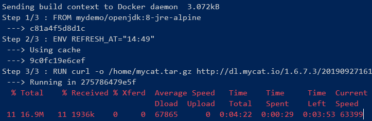
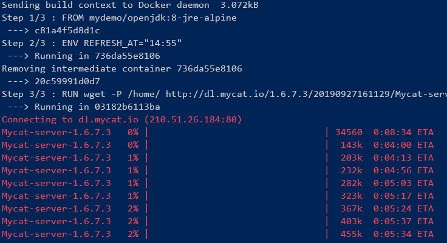

#### Run the demo application in Docker container
Prerequisites:
1. OS: Linux, Mac or Windows (with a bash shell, such as git bash);
2. JDK 8 and apache maven;
3. Docker;

##### `init.sh`
```sh
$PROJECT_HOME/docker/init.sh
```
Do initializations before you run the demo application first time:
1. Create a docker network, all containers in this demo application run in this docker network.
2. Build necessary docker images and run containers for MySQL, [Mycat](https://github.com/MyCATApache/Mycat-Server), [ShardingProxy](https://shardingsphere.apache.org/), [Nacos](https://github.com/alibaba/nacos), [Seata](https://github.com/seata/seata), [SkyWalking](http://skywalking.apache.org/), [ZipKin](https://github.com/openzipkin/zipkin). <br />
   Taking `init.sh` as reference, build and run containers as you want. <br />
   There's no docker support for [PinPoint](https://github.com/naver/pinpoint) in this demo application, please install it locally, or use the official docker support [naver/pinpoint-docker](https://github.com/naver/pinpoint-docker).

##### `package.sh`
```sh
$PROJECT_HOME/package.sh -clean -mycat -seata -zipkin
```
Compile and package demo application with variant components support.

##### `app-container.sh`
Build docker images and run containers for all Dubbo services and shop-web in this demo application.

```sh
# Build images, then run containers.
$PROJECT_HOME/docker/app-container.sh -build -run
# Stop and remove containers, remove images, so as to repackage and rerun the demo application.
$PROJECT_HOME/docker/app-container.sh -stop -rm -rmi
```

#### Comments on building docker images
1. For java applications, `openjdk:8-jre-alpine` is a better choice for base images.
   - `openjdk:8`: OS is Debian 10.2, image size: **510MB**;
   - `openjdk:8-jre-alpine`: OS is Alpine Linux, image size: **84.9MB**;
2. Use `curl` instead of `wget` to download to avoid progress status issues. 
   - `curl`: <br />
     
   - `wget`: <br />
     
3. In some cases [multi-stage builds](https://docs.docker.com/develop/develop-images/multistage-build/) is a very
   convenient way to build images for 3-party/complicated applications, see [docker/skywalking](skywalking/) for an example.
