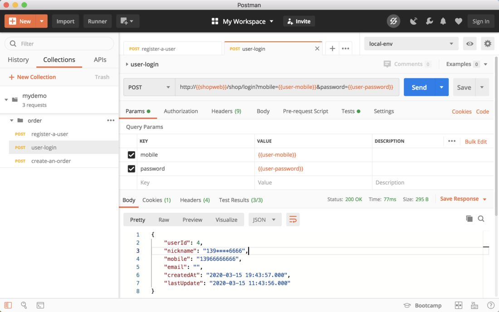
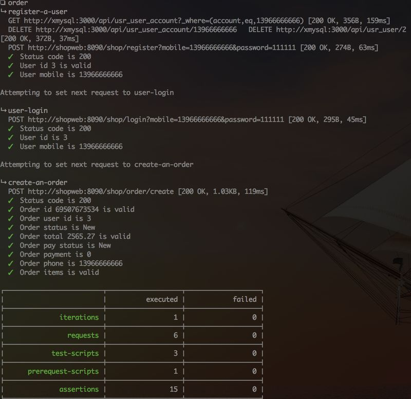

### Postman + Newman for Test Automation
Use `Postman` to build tests:  

`newman` is a command line tool for running `Postman` tests in shell, it can work with Jenkins:  

`xmysql` is used for `newman` to clear data in `MySQL` before running tests.
